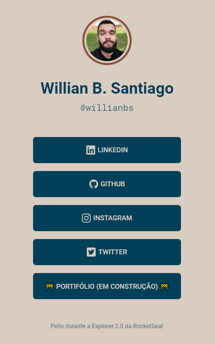

<h1>Linktree pessoal</h1>
<h2>Projeto proposto pela Rocketseat</h2>

Este projeto foi desenvolvido com base na trilha da Maratona Explorer 2.0. sendo apresentado um layout simples contando com uma imagem utlizando o link atalho do github para importar a foto de perfil, e logo abaixo os botões que levam para as principais redes sociais.

<h2>Modo escuro e SVG das Redes Sociais</h2>

Após finalizar o projeto fiquei com vontade de implementar um modo escuro e melhorar um pouco o visual das redes sociais.

Para implementar o modo escuro através do JavaScript utilizei a feature Toggle Class que basicamente adiciona a class que você deseja através de manipulação de DOM.

Link: https://wbsantiago.github.io/linktree-explorer/

-------------------------------------------------------------------

<h1>Personal Linktree</h1>
<h2>Project proposed by Rocketseat</h2>

This project was developed based on the Marathon Explorer 2.0 track. being presented a simple layout with an image using the github shortcut link to import the profile picture, and just below the buttons that lead to the main social networks.

<h2>Dark Mode and Social Media SVG</h2>

After finishing the project, I wanted to implement a dark mode and improve the look of social networks a bit.

To implement dark mode through JavaScript I used the Toggle Class feature which basically adds the class you want through DOM manipulation.

Link: https://wbsantiago.github.io/linktree-explorer/